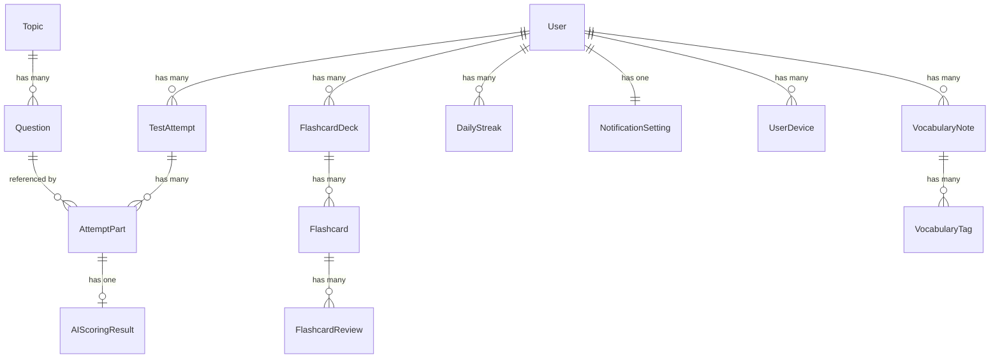

# 🖥️ Unilingo Backend — Kiến Trúc & Giải Thích Code

> **Công nghệ**: FastAPI + Python 3.11+  
> **Database**: PostgreSQL 16 (async via SQLAlchemy 2.0 + asyncpg)  
> **Cache/Queue**: Redis 7  
> **Task Queue**: Celery  
> **Storage**: MinIO (S3-compatible)  
> **AI Services**: OpenAI Whisper, Azure Speech, Google Gemini  
> **Auth**: JWT (jose) + bcrypt + Firebase Admin SDK  
> **Containerization**: Docker Compose (6 services)

---

## 📁 Cấu Trúc Thư Mục Tổng Quan

```
unilingo-backend/
├── docker-compose.yml              # 🐳 Docker stack (6 services)
├── Dockerfile                      # Build image cho FastAPI
├── requirements.txt                # Python dependencies
├── .env / .env.example             # Environment variables
├── app/
│   ├── __init__.py
│   ├── main.py                     # 🚀 FastAPI entry point + lifespan
│   ├── config.py                   # ⚙️ Pydantic Settings
│   ├── database.py                 # 🗄️ SQLAlchemy async engine + session
│   ├── seed.py                     # 🌱 Database seeder (IELTS topics)
│   ├── api/                        # 🌐 API Layer
│   │   ├── __init__.py
│   │   ├── deps.py                 #   FastAPI dependencies (auth, DB)
│   │   ├── response.py             #   Standard response envelope
│   │   └── v1/                     #   API Version 1
│   │       ├── __init__.py
│   │       ├── router.py           #   Central router (gom tất cả routes)
│   │       ├── auth.py             #   Auth routes
│   │       ├── users.py            #   User & Dashboard routes
│   │       ├── topics.py           #   Topics & Questions routes
│   │       ├── practice.py         #   Practice session routes
│   │       ├── vocabulary.py       #   Vocabulary CRUD routes
│   │       ├── flashcards.py       #   Flashcard routes
│   │       ├── leaderboard.py      #   Leaderboard routes
│   │       ├── notifications.py    #   Notification routes
│   │       └── admin.py            #   Admin routes
│   ├── models/                     # 📦 SQLAlchemy ORM Models
│   │   ├── __init__.py             #   Barrel export tất cả models
│   │   ├── user.py                 #   User, UserDevice, NotificationSetting, DailyStreak
│   │   ├── topic.py                #   Topic, Question
│   │   ├── practice.py             #   TestAttempt, AttemptPart, AIScoringResult
│   │   ├── vocabulary.py           #   VocabularyNote, VocabularyTag
│   │   ├── flashcard.py            #   FlashcardDeck, Flashcard, FlashcardReview
│   │   └── leaderboard.py          #   LeaderboardCache
│   ├── schemas/                    # 📋 Pydantic Schemas (request/response)
│   │   ├── __init__.py
│   │   ├── auth.py                 #   Auth schemas
│   │   ├── user.py                 #   User schemas
│   │   ├── topic.py                #   Topic schemas
│   │   ├── practice.py             #   Practice schemas
│   │   ├── vocabulary.py           #   Vocabulary schemas
│   │   ├── flashcard.py            #   Flashcard schemas
│   │   └── leaderboard.py          #   Leaderboard schemas
│   ├── services/                   # 🔧 Business Logic Services
│   │   ├── __init__.py
│   │   └── auth_service.py         #   Auth logic (JWT, password, Firebase)
│   ├── ai/                         # 🤖 AI Services
│   │   ├── __init__.py
│   │   └── scoring_service.py      #   AI Scoring Pipeline
│   └── workers/                    # ⚡ Celery Background Tasks
│       ├── __init__.py
│       ├── celery_app.py           #   Celery config + scheduled tasks
│       ├── scoring_tasks.py        #   AI scoring task
│       └── notification_tasks.py   #   Notification tasks
```

---

## 1. Entry Point & Configuration

### `main.py` — FastAPI Application

**Chức năng:**
1. **Lifespan events:**
   - **Startup:** Auto-create DB tables (dev mode), initialize Firebase Admin SDK.
   - **Shutdown:** Log graceful shutdown.
2. **CORS Middleware:** Allow all origins (cần restrict trong production).
3. **Router:** Mount toàn bộ API v1 routes.
4. **Health check:** `GET /health` trả về status + version.
5. **Docs:** Swagger UI (`/docs`) và ReDoc (`/redoc`) chỉ hiển thị khi `DEBUG=True`.

### `config.py` — Pydantic Settings

Sử dụng `pydantic-settings` với `BaseSettings` để đọc biến môi trường từ `.env`:

| Category | Variables | Default |
|---|---|---|
| **App** | APP_NAME, APP_VERSION, DEBUG, SECRET_KEY | Unilingo, 1.0.0, False |
| **Database** | DATABASE_URL | `postgresql+asyncpg://...` |
| **Redis** | REDIS_URL | `redis://localhost:6379/0` |
| **JWT** | JWT_SECRET_KEY, JWT_ALGORITHM, ACCESS_EXPIRE, REFRESH_EXPIRE | HS256, 30 mins, 30 days |
| **Firebase** | FIREBASE_SERVICE_ACCOUNT_PATH | `./firebase-service-account.json` |
| **AI** | OPENAI_API_KEY, GOOGLE_GEMINI_API_KEY, AZURE_SPEECH_KEY/REGION | Empty strings |
| **S3/MinIO** | S3_ENDPOINT_URL, S3_ACCESS_KEY, S3_SECRET_KEY, S3_BUCKET_NAME | MinIO defaults |
| **Celery** | CELERY_BROKER_URL, CELERY_RESULT_BACKEND | Redis DBs 1 & 2 |

**Caching:** `@lru_cache()` đảm bảo Settings chỉ parse 1 lần.

### `database.py` — Async Database Layer

```python
engine = create_async_engine(DATABASE_URL, pool_size=10, max_overflow=20)
AsyncSessionLocal = async_sessionmaker(engine, class_=AsyncSession)
```

| Function | Mô tả |
|---|---|
| `get_db()` | FastAPI dependency: tạo session → yield → commit/rollback → close |
| `init_db()` | Tạo tất cả tables từ models (dùng trong dev, production dùng Alembic) |

**Pattern:** Mỗi request có 1 async session riêng, auto-commit khi thành công, auto-rollback khi exception.

---

## 2. API Layer (`app/api/`)

### `deps.py` — FastAPI Dependencies

| Dependency | Mô tả |
|---|---|
| `get_current_user()` | Extract JWT từ `Authorization: Bearer <token>` → decode → query User từ DB → kiểm tra `is_active` |
| `get_admin_user()` | Extends `get_current_user` → kiểm tra thêm `is_admin` |

**Flow xác thực:**
```
Request → HTTPBearer extract token → decode_token() → Lấy user_id từ "sub"
→ Query User bằng UUID → Verify is_active → Return User object
```

### `response.py` — Standard Response Envelope

```json
// Success
{ "status_code": 200, "message": "Success", "data": {...} }

// Error
{ "status_code": 400, "message": "Error description" }
```

Có global exception handlers cho `HTTPException` và `RequestValidationError`.

### `v1/router.py` — Central Router

Gom tất cả 9 route modules vào prefix `/api/v1`:
- `auth`, `users`, `topics`, `practice`, `vocabulary`, `flashcards`, `leaderboard`, `notifications`, `admin`

---

## 3. API Routes Chi Tiết

### `v1/auth.py` — Authentication Routes

| Endpoint | Method | Auth? | Mô tả |
|---|---|---|---|
| `/auth/register` | POST | ❌ | Đăng ký user mới → trả tokens |
| `/auth/login` | POST | ❌ | Đăng nhập email/password → trả tokens |
| `/auth/social-login` | POST | ❌ | Đăng nhập Google/Apple qua Firebase |
| `/auth/refresh` | POST | ❌ | Refresh access token |
| `/auth/logout` | POST | ✅ | Invalidate session (placeholder) |
| `/auth/forgot-password` | POST | ❌ | Gửi email reset password (placeholder) |

### `v1/users.py` — User Management Routes

| Endpoint | Method | Auth? | Mô tả |
|---|---|---|---|
| `/users/me` | GET | ✅ | Lấy profile hiện tại |
| `/users/me` | PATCH | ✅ | Cập nhật profile (name, username, target band, level) |
| `/users/me/dashboard` | GET | ✅ | Dashboard tổng hợp: today_stats, weekly_trend, skill_breakdown, vocab_stats |
| `/users/me/streaks` | GET | ✅ | Thông tin streak |
| `/users/me/change-password` | POST | ✅ | Đổi mật khẩu (verify current → hash new) |

### `v1/topics.py` — Topics & Questions Routes

| Endpoint | Method | Auth? | Mô tả |
|---|---|---|---|
| `/topics` | GET | ✅ | Danh sách topics, filter: ielts_part, category, difficulty |
| `/topics/{id}` | GET | ✅ | Chi tiết topic + question count |
| `/topics/{id}/questions` | GET | ✅ | Danh sách câu hỏi của topic |
| `/topics/recommended` | GET | ✅ | Topics đề xuất theo level user |

### `v1/practice.py` — Practice Session Routes

| Endpoint | Method | Auth? | Mô tả |
|---|---|---|---|
| `/practice/start` | POST | ✅ | Tạo TestAttempt mới, random question, trả question data |
| `/practice/{id}/upload-audio` | POST | ✅ | Upload file .m4a (lưu MinIO), tạo AttemptPart |
| `/practice/{id}/submit` | POST | ✅ | Đánh dấu "scoring", enqueue Celery task `score_practice_attempt` |
| `/practice/{id}/result` | GET | ✅ | Lấy kết quả: band scores, transcript, AI feedback |
| `/practice/history` | GET | ✅ | Lịch sử, phân trang, filter by ielts_part |
| `/practice/stats` | GET | ✅ | Thống kê: total tests, hours, avg/best band, per-part avg |

### `v1/vocabulary.py` — Vocabulary CRUD Routes

| Endpoint | Method | Auth? | Mô tả |
|---|---|---|---|
| `/vocabulary` | GET | ✅ | Danh sách từ, filter: mastery_level, search, sort, phân trang |
| `/vocabulary` | POST | ✅ | Thêm từ mới (word, definitions, examples, tags) |
| `/vocabulary/{id}` | PATCH | ✅ | Cập nhật từ |
| `/vocabulary/{id}` | DELETE | ✅ | Xóa từ |
| `/vocabulary/review-due` | GET | ✅ | Từ cần ôn tập (SRS due date) |
| `/vocabulary/dictionary/lookup` | GET | ✅ | Tra từ điển online (Free Dictionary API) |

### `v1/flashcards.py` — Flashcard Routes

| Endpoint | Method | Auth? | Mô tả |
|---|---|---|---|
| `/flashcards/decks` | GET | ✅ | Danh sách decks của user |
| `/flashcards/decks` | POST | ✅ | Tạo deck mới |
| `/flashcards/decks/{id}` | GET | ✅ | Chi tiết deck + list cards |
| `/flashcards/decks/{id}` | PATCH | ✅ | Cập nhật deck |
| `/flashcards/decks/{id}` | DELETE | ✅ | Xóa deck + tất cả cards |
| `/flashcards/decks/{id}/cards` | POST | ✅ | Thêm card vào deck |
| `/flashcards/decks/{id}/study` | GET | ✅ | Lấy cards due for study (SRS) |
| `/flashcards/cards/{id}` | DELETE | ✅ | Xóa card |
| `/flashcards/cards/{id}/review` | POST | ✅ | Ghi nhận review + cập nhật SRS (SM-2) |
| `/flashcards/decks/auto-generate` | POST | ✅ | Tạo deck tự động từ vocabulary |

### `v1/leaderboard.py` — Leaderboard Routes

| Endpoint | Method | Auth? | Mô tả |
|---|---|---|---|
| `/leaderboard` | GET | ✅ | Bảng xếp hạng: weekly/monthly/all_time |
| `/leaderboard/me` | GET | ✅ | Ranking của user hiện tại |

### `v1/notifications.py` — Notification Routes

| Endpoint | Method | Auth? | Mô tả |
|---|---|---|---|
| `/notifications/settings` | GET | ✅ | Lấy cài đặt notification |
| `/notifications/settings` | PATCH | ✅ | Cập nhật cài đặt notification |
| `/notifications/devices` | POST | ✅ | Đăng ký FCM device token |

### `v1/admin.py` — Admin Routes

| Endpoint | Method | Auth? | Mô tả |
|---|---|---|---|
| `/admin/topics` | POST | 🔒 Admin | Tạo topic mới |
| `/admin/topics/{id}/questions` | POST | 🔒 Admin | Thêm câu hỏi |
| `/admin/seed` | POST | 🔒 Admin | Seed database |
| `/admin/stats` | GET | 🔒 Admin | Thống kê hệ thống |

---

## 4. Database Models (`app/models/`)

### Model Relationships



### Danh sách Models

| Model | Bảng | Fields chính |
|---|---|---|
| **User** | `users` | id (UUID), email, hashed_password, full_name, username, avatar_url, auth_provider, firebase_uid, total_xp, current_streak, longest_streak, target_band_score, current_level, is_admin, is_active |
| **UserDevice** | `user_devices` | user_id, fcm_token, device_type, device_name |
| **NotificationSetting** | `notification_settings` | user_id, daily_reminder, streak_alert, new_words_reminder |
| **DailyStreak** | `daily_streaks` | user_id, streak_date, practice_count |
| **Topic** | `topics` | id (UUID), title, title_vi, description, category, ielts_part, difficulty, icon, is_active, order_index |
| **Question** | `questions` | id (UUID), topic_id (FK), question_text, question_text_vi, ielts_part, cue_card_content, follow_up_questions, sample_answer, key_vocabulary, difficulty |
| **TestAttempt** | `test_attempts` | id (UUID), user_id (FK), topic_id (FK), ielts_part, status (in_progress/scoring/completed/failed), overall_band, fluency/lexical/grammar/pronunciation_score, xp_earned, started_at, completed_at |
| **AttemptPart** | `attempt_parts` | id (UUID), attempt_id (FK), question_id (FK), part_number, audio_url, transcript, duration_seconds |
| **AIScoringResult** | `ai_scoring_results` | attempt_part_id (FK), fluency/lexical/grammar/pronunciation_band, overall_band, feedback (JSON), strengths, weaknesses, suggested_improvements, grammar_errors, vocabulary_suggestions |
| **VocabularyNote** | `vocabulary_notes` | id (UUID), user_id (FK), word, phonetic, audio_url, definitions (JSON), examples (JSON), user_note, mastery_level, review_count, next_review_at |
| **VocabularyTag** | `vocabulary_tags` | vocabulary_id (FK), tag |
| **FlashcardDeck** | `flashcard_decks` | id (UUID), user_id (FK), title, description, is_public, card_count |
| **Flashcard** | `flashcards` | id (UUID), deck_id (FK), vocabulary_id (FK nullable), front_content, back_content, audio_url, extra_info (JSON), order_index, easiness_factor, interval_days, repetition_number, next_review_at |
| **FlashcardReview** | `flashcard_reviews` | flashcard_id (FK), quality_rating, reviewed_at |
| **LeaderboardCache** | `leaderboard_cache` | user_id (FK), period, rank, avg_band_score, total_tests, total_xp |

---

## 5. Services Layer

### `services/auth_service.py` — Authentication Service

| Function | Mô tả |
|---|---|
| `hash_password(password)` | Bcrypt hash |
| `verify_password(plain, hashed)` | Bcrypt verify |
| `create_access_token(user_id)` | JWT access token, expire 30 mins |
| `create_refresh_token(user_id)` | JWT refresh token, expire 30 days |
| `decode_token(token)` | Decode + verify JWT, raise 401 nếu invalid/expired |
| `register_user(db, email, password, full_name)` | Check duplicate email/username → create User + NotificationSetting |
| `authenticate_user(db, email, password)` | Query user by email → verify password → check is_active |
| `social_login(db, firebase_uid, email, ...)` | Find by firebase_uid → or link by email → or create new |
| `generate_tokens(user_id)` | Tạo cặp access + refresh token |

---

## 6. AI Scoring Pipeline (`app/ai/scoring_service.py`)

### Pipeline Architecture

```
Audio File (S3/MinIO)
    │
    ├──→ [Step 1: OpenAI Whisper STT] ──→ Transcript (text)
    │
    ├──→ [Step 2: Azure Speech Service] ──→ Pronunciation Scores
    │         (accuracy, fluency, prosody, completeness)
    │
    └──→ [Step 3: Google Gemini LLM]
              Input: transcript + pronunciation + question
              Output: Band scores + Feedback (structured JSON)
                  ├── fluency_band, lexical_band, grammar_band, pronunciation_band
                  ├── overall_band
                  ├── feedback: { summary, detailed }
                  ├── strengths[], weaknesses[]
                  ├── suggested_improvements[]
                  ├── sample_better_answer: { text, explanation }
                  ├── grammar_errors[]: { original, corrected, rule }
                  └── vocabulary_suggestions[]: { basic_word, better_alternatives[] }
```

### Các hàm chính

| Function | Mô tả |
|---|---|
| `transcribe_audio(audio_url)` | Gọi OpenAI Whisper API để chuyển audio → text. Mock nếu không có API key. |
| `assess_pronunciation(audio_url)` | Gọi Azure Speech Service cho pronunciation assessment. Trả về scores 0-100. Mock nếu không có key. |
| `score_with_llm(transcript, question, part, pronunciation)` | Gọi Google Gemini 2.0 Flash với prompt template chi tiết. Trả về structured JSON với band scores + feedback. Mock nếu không có key. |
| `run_scoring_pipeline(audio_url, question, part)` | Orchestrator: chạy 3 bước tuần tự → merge results. |

### LLM Prompt

Prompt rất chi tiết yêu cầu Gemini đóng vai "IELTS Speaking examiner", chấm theo 4 tiêu chí chính thức:
1. Fluency & Coherence
2. Lexical Resource  
3. Grammatical Range & Accuracy
4. Pronunciation

Output bắt buộc JSON format với `response_mime_type: "application/json"`, `temperature: 0.3`.

### Mock Mode

Khi API keys chưa set (development), tất cả 3 bước đều trả mock data rất chi tiết — cho phép frontend hoạt động đầy đủ mà không cần external services.

---

## 7. Background Workers (`app/workers/`)

### `celery_app.py` — Celery Configuration

- **Broker:** Redis DB 1
- **Backend:** Redis DB 2
- **Serializer:** JSON
- **Time limits:** 5 minutes max per task

**Scheduled tasks (Celery Beat):**

| Task | Schedule | Mô tả |
|---|---|---|
| `send_daily_vocabulary_reminders` | Daily 9:00 UTC | Push notification cho users có từ cần ôn |
| `send_streak_alerts` | Daily 18:00 UTC | Cảnh báo streak sắp mất |
| `update_leaderboard_cache` | Every hour | Cập nhật bảng xếp hạng cache |

### `scoring_tasks.py` — AI Scoring Task

```python
@celery_app.task(bind=True, max_retries=3, default_retry_delay=30)
def score_practice_attempt(self, attempt_id: str):
```

**Flow:**
1. Load `TestAttempt` + `AttemptPart` từ DB.
2. Với mỗi part có `audio_url`:
   - Chạy `run_scoring_pipeline()` → transcript + scores.
   - Lưu `AIScoringResult` vào DB.
3. Tính trung bình band scores qua tất cả parts.
4. Tính XP: `overall_band × 10`.
5. Cập nhật status = `completed`.
6. **Retry logic:** Max 3 retries, delay 30s giữa các lần.

### `notification_tasks.py` — Notification Tasks

3 tasks placeholder (TODO):
- `send_daily_vocabulary_reminders()` — FCM push cho vocabulary review.
- `send_streak_alerts()` — FCM push cho streak at risk.
- `update_leaderboard_cache()` — Tính toán rankings → Redis Sorted Set + DB cache.

---

## 8. Database Seeder (`app/seed.py`)

**Chạy:** `python -m app.seed`

Seed 10 IELTS topics với câu hỏi thực tế (tiếng Anh + tiếng Việt):

| Part | Topics | Difficulty |
|---|---|---|
| **Part 1** | Work & Studies, Hometown, Hobbies, Technology | Easy - Medium |
| **Part 2** | A Place You Visited, A Person Who Inspired You, A Book/Movie | Medium |
| **Part 3** | Education & Learning, Environment & Climate, Technology & Society | Hard |

Mỗi topic có 3-5 câu hỏi. Part 2 có cue card content + sample answer.

---

## 9. Docker Compose — Infrastructure

```
docker-compose.yml
├── api (FastAPI)           Port 8000   — Main backend
├── db (PostgreSQL 16)      Internal    — Primary database
├── redis (Redis 7)         Port 6379   — Cache + Celery broker
├── minio (MinIO)           Port 9000/9001 — S3 storage for audio
├── celery-worker           —           — Process scoring tasks
└── celery-beat             —           — Schedule periodic tasks
```

**Health checks:** PostgreSQL (`pg_isready`) và Redis (`redis-cli ping`) có health checks, API wait for healthy dependencies.

**Volumes:** `postgres_data`, `redis_data`, `minio_data` cho persistent storage.

---

## 10. Luồng Dữ Liệu Chính (Backend)

### Flow: Register
```
POST /auth/register {email, password, full_name}
  → auth_service.register_user()
    → Check email/username uniqueness
    → hash_password() → Create User + NotificationSetting
    → generate_tokens() → Return {access_token, refresh_token}
```

### Flow: Practice Scoring
```
POST /practice/start {topic_id, ielts_part}
  → Create TestAttempt (status=in_progress)
  → Random select Question from topic
  → Return question data to frontend

POST /practice/{id}/upload-audio [multipart/form-data]
  → Save audio file to MinIO (S3)
  → Create AttemptPart with audio_url

POST /practice/{id}/submit
  → Set status = "scoring"
  → Enqueue Celery task: score_practice_attempt(attempt_id)
  → Return immediately (async processing)

[Celery Worker picks up task]
  → Load attempt + parts from DB
  → For each part with audio:
    → Whisper STT → transcript
    → Azure Speech → pronunciation scores
    → Gemini LLM → band scores + feedback
    → Save AIScoringResult
  → Update attempt: overall_band, xp_earned, status=completed

GET /practice/{id}/result
  → If status=scoring → return partial result (frontend polls)
  → If status=completed → return full result with scores + feedback
```

### Flow: Vocabulary + Flashcard SRS
```
POST /vocabulary {word, definitions, ...}
  → Create VocabularyNote (mastery_level=new)
  → Schedule first review (next_review_at)

POST /flashcards/decks/auto-generate {mastery_levels: [new, learning]}
  → Query user's vocabulary with matching mastery
  → Create FlashcardDeck + Flashcard for each word
  → Return deck with card_count

POST /flashcards/cards/{id}/review {quality_rating: 1-5}
  → SM-2 Algorithm:
    → quality 1 (Again) → reset interval to 1 day
    → quality 3 (Hard) → short interval increase
    → quality 5 (Easy) → double interval
  → Update: next_review_at, interval_days, easiness_factor
  → Return next review schedule
```
