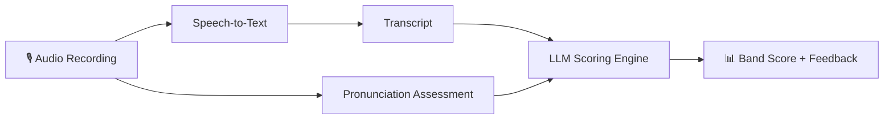
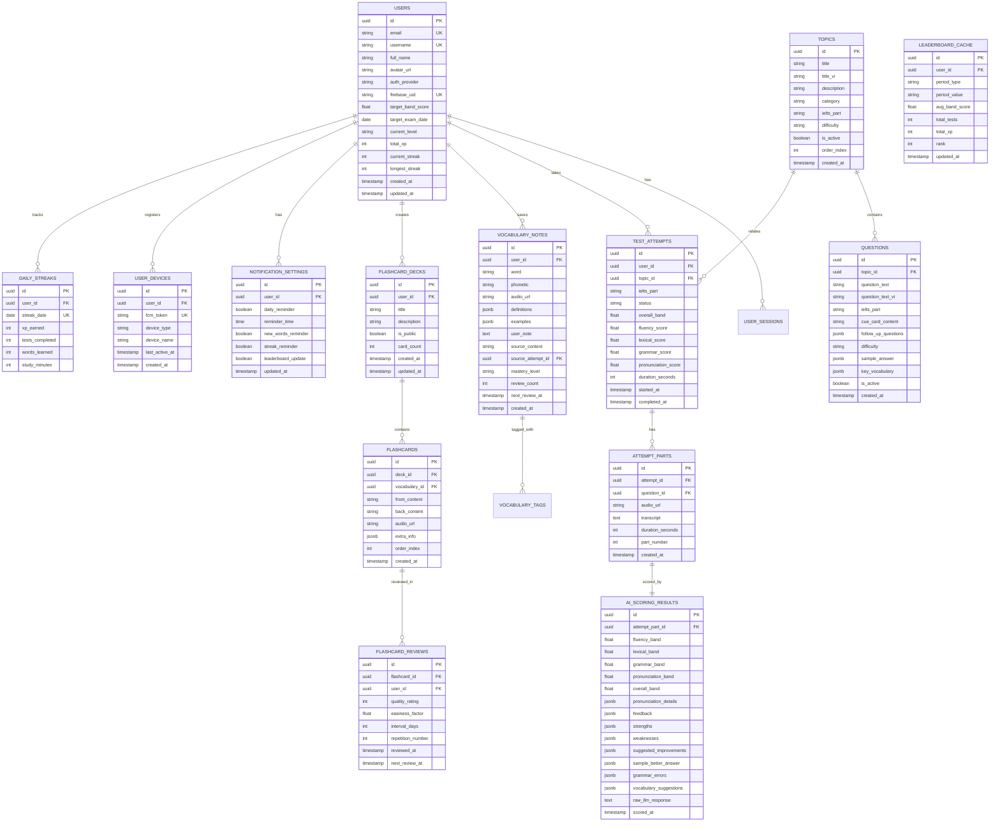
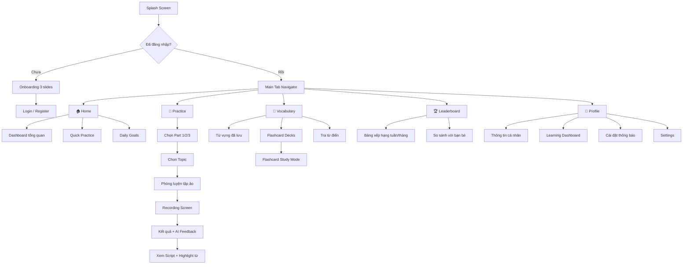
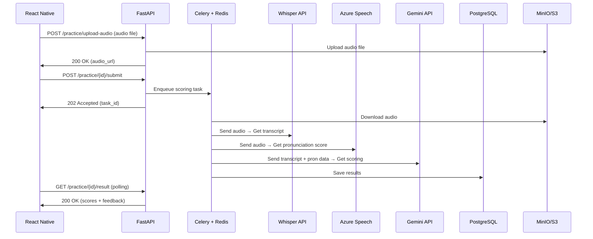

# 🎯 Unilingo - Nền tảng Luyện thi IELTS Speaking

## Tổng quan dự án

**Unilingo** là ứng dụng mobile luyện thi IELTS Speaking (và mở rộng sang Listening, Reading, Writing) với tính năng chấm chữa bằng AI, phòng luyện tập ảo, từ vựng thông minh, và bảng xếp hạng cộng đồng.

---

## 1. Tech Stack đề xuất

### 1.1. Frontend (Mobile)

| Công nghệ | Mục đích |
|:---|:---|
| **React Native (Expo Bare Workflow)** | Framework chính, dùng bare workflow để tích hợp native modules |
| **React Navigation v7** | Điều hướng giữa các màn hình |
| **React Native Reanimated v3** | Animation mượt mà (flip card, transitions) |
| **React Native Gesture Handler** | Xử lý swipe, long-press cho flashcard và highlight text |
| **React Native Paper / Tamagui** | UI component library |
| **Zustand** | State management nhẹ, hiệu quả |
| **React Query (TanStack Query)** | Data fetching, caching, sync với backend |
| **@react-native-firebase/messaging** | Push notification |
| **react-native-live-audio-stream** | Thu âm audio real-time |
| **Lottie React Native** | Animation hiệu ứng (hoàn thành bài, streak) |
| **react-native-mmkv** | Local storage nhanh (cache từ vựng, settings) |
| **Notifee** | Local notification scheduling (nhắc nhở học từ vựng) |

### 1.2. Backend

| Công nghệ | Mục đích |
|:---|:---|
| **FastAPI (Python 3.11+)** | REST API framework chính |
| **SQLAlchemy 2.0 + Alembic** | ORM & database migration |
| **PostgreSQL 16** | Database chính |
| **Redis** | Cache, session, rate limiting, leaderboard (Sorted Sets) |
| **Celery + Redis (broker)** | Background tasks (chấm bài AI, gửi notification) |
| **MinIO / AWS S3** | Lưu trữ file audio recording |
| **Docker + Docker Compose** | Containerization |
| **Nginx** | Reverse proxy |

### 1.3. AI Models (Chấm chữa) ⭐

> [!IMPORTANT]
> Đây là phần core của ứng dụng. Tôi đề xuất kiến trúc **pipeline hybrid** kết hợp nhiều model:



| Thành phần | Đề xuất chính | Lựa chọn thay thế | Chi phí |
|:---|:---|:---|:---|
| **Speech-to-Text (STT)** | **OpenAI Whisper API** | Deepgram, AssemblyAI | ~$0.006/phút |
| **Pronunciation Assessment** | **Azure Speech Service** | Google Cloud STT | ~$1/1000 requests |
| **Scoring & Feedback (LLM)** | **Google Gemini 2.0 Flash** | OpenAI GPT-4o-mini, Claude Haiku | ~$0.1/1M input tokens |
| **Grammar Check** | **LanguageTool API** (self-hosted) | Grammarly API | Miễn phí (self-host) |

#### Pipeline chấm điểm chi tiết:

1. **Bước 1 - STT**: Audio → Whisper API → Transcript text
2. **Bước 2 - Pronunciation**: Audio → Azure Speech Service → Pronunciation score (accuracy, fluency, prosody)
3. **Bước 3 - LLM Scoring**: Transcript + Pronunciation data → Gemini/GPT → JSON structured output:
   - **Fluency & Coherence** (Band 1-9)
   - **Lexical Resource** (Band 1-9)
   - **Grammatical Range & Accuracy** (Band 1-9)
   - **Pronunciation** (Band 1-9)
   - **Overall Band Score**
   - **Detailed Feedback** (điểm mạnh, điểm yếu, gợi ý cải thiện)
   - **Sample Better Answers**

> [!TIP]
> Dùng **Chain-of-Thought prompting** với IELTS Band Descriptors chính thức để LLM scoring chính xác hơn. Prompt nên bao gồm rubric đánh giá chi tiết cho từng band.

### 1.4. Third-party Services

| Dịch vụ | Mục đích |
|:---|:---|
| **Firebase** | Auth (Google/Apple sign-in), FCM push notification, Analytics |
| **Azure Speech Service** | Pronunciation assessment API |
| **OpenAI Whisper API** | Speech-to-text |
| **Google Gemini API** | LLM scoring + feedback generation |
| **DictionaryAPI.dev** | Tra cứu từ điển miễn phí (definitions, phonetics, audio) |
| **MinIO / S3** | Lưu audio files |
| **Sentry** | Error tracking & monitoring |
| **Firebase Analytics / Mixpanel** | User behavior analytics |

---

## 2. Database Schema (PostgreSQL)



---

## 3. Thiết kế Giao diện (UI/UX)

### 3.1. Luồng Navigation chính



### 3.2. Chi tiết từng màn hình

---

#### 🔐 Module 1: Authentication

| Màn hình | Mô tả | Thành phần UI |
|:---|:---|:---|
| **Splash Screen** | Logo + loading animation (Lottie) | Logo Unilingo, gradient background, loading spinner |
| **Onboarding** | 3 slides giới thiệu tính năng | Illustration, title, subtitle, dot indicator, Skip/Next button |
| **Login** | Đăng nhập | Email/password input, "Continue with Google" button, "Continue with Apple" button, "Forgot password?" link |
| **Register** | Đăng ký | Full name, email, password, confirm password, ToS checkbox |
| **Set Target** | Chọn mục tiêu (sau register) | Band score target slider (5.0-9.0), exam date picker, current level selector |

**Gợi ý thiết kế:**
- Gradient nền: `#667EEA → #764BA2` (xanh tím)
- Logo style: Modern, rounded, sử dụng biểu tượng sóng âm thanh + globe
- Social login buttons với icon lớn, rõ ràng
- Micro-animation khi chuyển giữa các onboarding slides

---

#### 🏠 Module 2: Home (Dashboard)

| Thành phần | Mô tả |
|:---|:---|
| **Header** | Avatar thumbnail + "Good morning, [name]!" + notification bell (badge count) |
| **Daily Progress Card** | Ring chart hiển thị: tests done / target, XP earned, streak fire icon 🔥 |
| **Quick Practice** | 3 nút nhanh: Part 1 / Part 2 / Part 3 với icon riêng |
| **Recent Activity** | Horizontal scroll list: các bài test gần đây, mỗi item hiển thị topic, band score, thời gian |
| **Suggested Topics** | Horizontal card list: topics được recommend based on weaknesses |
| **Words to Review** | Mini card: "5 words need review today" → navigate to Flashcard |
| **Weekly Chart** | Line chart mini hiển thị band score trend 7 ngày gần nhất |

**Gợi ý thiết kế:**
- Card style: Glassmorphism (semi-transparent white, blur background)
- Color scheme: Dark mode mặc định, accent color xanh dương `#4F46E5`
- Progress ring: Animated fill, gradient stroke
- Streak counter: Fire emoji + shake animation khi streak tăng

---

#### 📝 Module 3: Practice (Phòng luyện tập ảo) ⭐ CORE

##### 3.3.1. Chọn Part & Topic

| Màn hình | Mô tả |
|:---|:---|
| **Part Selector** | 3 card lớn cho Part 1, Part 2, Part 3 với mô tả ngắn gọn thời gian, số lượng câu hỏi |
| **Topic Grid** | Grid 2 cột các topic cards, mỗi card có: icon, tên topic, difficulty badge (Easy/Medium/Hard), completion rate bar |
| **Topic Detail** | Mô tả topic, danh sách câu hỏi mẫu (blur/preview), nút "Start Practice", estimated time |

##### 3.3.2. Phòng luyện tập ảo (Virtual Practice Room)

```
┌──────────────────────────────────────────┐
│  ⬅ Back           Part 2 - Topic Name    │
│─────────────────────────────────────────│
│                                          │
│   ┌────────────────────────────────┐     │
│   │   🤖 AI Examiner Avatar       │     │
│   │   (Lottie animation speaking)  │     │
│   └────────────────────────────────┘     │
│                                          │
│   ┌────────────────────────────────┐     │
│   │   Question Text                │     │
│   │   "Describe a place you        │     │
│   │    have visited recently..."    │     │
│   └────────────────────────────────┘     │
│                                          │
│   ┌────────────────────────────────┐     │
│   │   📋 Cue Card (Part 2 only)   │     │
│   │   You should say:              │     │
│   │   • where it was              │     │
│   │   • when you went there       │     │
│   │   • what you did there        │     │
│   │   • and explain why you...    │     │
│   └────────────────────────────────┘     │
│                                          │
│   Preparation Time: ⏱️ 00:45            │
│                                          │
│   ┌───────────┐  ┌──────────────────┐   │
│   │  📝 Notes │  │  🎙️ Start Record │   │
│   └───────────┘  └──────────────────┘   │
│                                          │
└──────────────────────────────────────────┘
```

##### 3.3.3. Recording Screen

```
┌──────────────────────────────────────────┐
│                                          │
│           ⏱️ 01:23 / 02:00              │
│                                          │
│       ╔══════════════════════╗           │
│       ║  🎙️ Recording...    ║           │
│       ║  ████████████░░░░░░  ║           │
│       ║  (Waveform animation)║           │
│       ╚══════════════════════╝           │
│                                          │
│   Question text hiển thị phía trên       │
│   (có thể ẩn/hiện)                       │
│                                          │
│       ┌─────────┐ ┌──────────┐          │
│       │ ⏸️ Pause │ │ ⏹️ Stop  │          │
│       └─────────┘ └──────────┘          │
│                                          │
│   💡 Tip: Remember to speak clearly     │
│                                          │
└──────────────────────────────────────────┘
```

##### 3.3.4. Kết quả & AI Feedback ⭐

```
┌──────────────────────────────────────────┐
│  ⬅ Back                   🔄 Retry      │
│─────────────────────────────────────────│
│                                          │
│   Overall Band Score                     │
│   ┌────────────────────────────────┐     │
│   │         ╭─────╮               │     │
│   │         │ 6.5 │  Good!        │     │
│   │         ╰─────╯               │     │
│   │   (animated circular gauge)    │     │
│   └────────────────────────────────┘     │
│                                          │
│   ┌─ Detailed Scores ────────────────┐  │
│   │ Fluency & Coherence    ████░ 6.0 │  │
│   │ Lexical Resource       █████ 7.0 │  │
│   │ Grammar Range          ████░ 6.5 │  │
│   │ Pronunciation          ████░ 6.5 │  │
│   └──────────────────────────────────┘  │
│                                          │
│   📌 Strengths                           │
│   • Good use of topic vocabulary         │
│   • Natural pace and rhythm              │
│                                          │
│   ⚠️ Areas to Improve                   │
│   • Limited use of complex sentences     │
│   • Some pronunciation errors on...      │
│                                          │
│   ┌─ Tabs ───────────────────────────┐  │
│   │ [Script] [Feedback] [Sample Ans] │  │
│   └──────────────────────────────────┘  │
│                                          │
│   📜 Your Script (Transcript)            │
│   "I would like to *talk* about a        │
│   place I visited *recently*. It was     │
│   a beautiful beach in..."               │
│                                          │
│   ⬆️ Bôi đen/Long-press từ để xem      │
│      nghĩa và thêm vào Vocabulary Notes │
│                                          │
│   ┌─────────────────────────────┐       │
│   │ 🔄 Retry │ 📤 Share │ 💾 Save│       │
│   └─────────────────────────────┘       │
└──────────────────────────────────────────┘
```

##### 3.3.5. Highlight từ vựng (Popup khi bôi đen/long-press)

```
┌──────────────────────────────────┐
│  📖 "coherent"                   │
│  /koʊˈhɪrənt/ 🔊                │
│                                  │
│  adj. logical and consistent     │
│                                  │
│  Example: "She gave a coherent   │
│  explanation of the problem."    │
│                                  │
│  ┌──────────┐ ┌───────────────┐ │
│  │ ➕ Save   │ │ 📝 Add Note   │ │
│  └──────────┘ └───────────────┘ │
└──────────────────────────────────┘
```

---

#### 📖 Module 4: Vocabulary & Flashcard

| Màn hình | Mô tả |
|:---|:---|
| **Vocabulary List** | Danh sách từ đã lưu, filter theo mastery level (New/Learning/Mastered), search bar, sort by date/alphabet |
| **Vocabulary Detail** | Word, phonetic, audio, definitions, examples, user note (editable), source context, mastery progress bar |
| **Dictionary Search** | Search bar + real-time suggestions, kết quả hiển thị definitions, phonetics, audio playback |
| **Flashcard Decks** | Grid các bộ flashcard: My Decks, Auto-generated (từ words saved), mỗi deck hiển thị card count + completion % |
| **Flashcard Study** | Swipe interface: card lật (front: word → back: meaning), swipe right (know) / left (don't know), progress bar |
| **Deck Detail** | Danh sách cards trong deck, nút Start Study, Edit Deck, Share Deck |

**Gợi ý thiết kế Flashcard Study:**
```
┌──────────────────────────────────────────┐
│  ⬅ Back    Deck: IELTS Environment    5/20│
│  ████████████░░░░░░░░░░░░░░░░░░         │
│──────────────────────────────────────────│
│                                          │
│   ┌────────────────────────────────┐     │
│   │                                │     │
│   │                                │     │
│   │        "sustainable"           │     │
│   │                                │     │
│   │     /səˈsteɪnəbəl/ 🔊        │     │
│   │                                │     │
│   │       Tap to flip              │     │
│   │                                │     │
│   └────────────────────────────────┘     │
│                                          │
│   ← Swipe left: Don't know              │
│   → Swipe right: Know it!               │
│                                          │
│   ┌──────┐  ┌──────┐  ┌──────┐         │
│   │  ❌  │  │  🤔  │  │  ✅  │         │
│   │Again │  │ Hard │  │ Easy │         │
│   └──────┘  └──────┘  └──────┘         │
│                                          │
└──────────────────────────────────────────┘
```

- Sử dụng **Spaced Repetition (SM-2 algorithm)** cho flashcard scheduling
- Card flip animation với `react-native-reanimated` (3D perspective flip)
- Haptic feedback khi swipe

---

#### 🏆 Module 5: Leaderboard

| Màn hình | Mô tả |
|:---|:---|
| **Main Leaderboard** | Tab: Weekly / Monthly / All-time |
| **Ranking List** | Top 3 podium (gold/silver/bronze) + scrollable list, mỗi item: rank, avatar, name, avg band, XP |
| **My Ranking Card** | Fixed bottom bar: your rank, avatar, score (luôn hiển thị) |
| **User Card (tap)** | Modal: xem profile tóm tắt (avatar, stats, so sánh với bạn) |

**Gợi ý thiết kế:**
```
┌──────────────────────────────────────────┐
│               🏆 Leaderboard             │
│  ┌────────┐ ┌────────┐ ┌────────────┐   │
│  │ Weekly │ │Monthly │ │ All-time   │   │
│  └────────┘ └────────┘ └────────────┘   │
│──────────────────────────────────────────│
│                                          │
│        🥈         🥇         🥉          │
│      ╭───╮      ╭───╮      ╭───╮        │
│      │ 2 │      │ 1 │      │ 3 │        │
│      ╰───╯      ╰───╯      ╰───╯        │
│      Jane       Alex       Mike          │
│      7.5        8.0        7.0           │
│                                          │
│  4. ─────────────────────────── 2450 XP  │
│  5. ─────────────────────────── 2320 XP  │
│  6. ─────────────────────────── 2100 XP  │
│  ...                                     │
│                                          │
│  ┌──────────────────────────────────┐    │
│  │ 📍 #12  You     7.0 avg  1850XP│    │
│  └──────────────────────────────────┘    │
└──────────────────────────────────────────┘
```

- Sử dụng **Redis Sorted Sets** cho real-time ranking
- Animated position changes khi rank thay đổi
- Confetti animation cho top 3

---

#### 👤 Module 6: Profile & Dashboard

| Màn hình | Mô tả |
|:---|:---|
| **Profile View** | Avatar (upload/camera), full name, email, target band, join date, total practice hours |
| **Edit Profile** | Form chỉnh sửa: name, avatar, target band, target exam date, notification preferences |
| **Learning Dashboard** | Charts & statistics tổng hợp |
| **Settings** | Dark/Light mode, language (EN/VN), notification settings, logout, delete account |

**Learning Dashboard layout:**
```
┌──────────────────────────────────────────┐
│  📊 Learning Dashboard                   │
│──────────────────────────────────────────│
│                                          │
│  ┌─ Overall Progress ────────────────┐  │
│  │  Target: 7.0    Current: 6.5      │  │
│  │  ████████████████████░░░░░  86%   │  │
│  │  Tests taken: 45  │  Hours: 23h   │  │
│  └───────────────────────────────────┘  │
│                                          │
│  ┌─ Band Score Trend (Line Chart) ───┐  │
│  │  8.0 ─                             │  │
│  │  7.0 ─      ╱─╲    ╱─────         │  │
│  │  6.0 ─ ────╱   ╲──╱               │  │
│  │  5.0 ─                             │  │
│  │       W1  W2  W3  W4  W5  W6      │  │
│  └────────────────────────────────────┘  │
│                                          │
│  ┌─ Skills Breakdown (Radar Chart) ──┐  │
│  │          Fluency                   │  │
│  │            ╱╲                      │  │
│  │   Pronun. ╱  ╲ Lexical            │  │
│  │           ╲  ╱                     │  │
│  │            ╲╱                      │  │
│  │          Grammar                   │  │
│  └────────────────────────────────────┘  │
│                                          │
│  ┌─ Activity Calendar (Heatmap) ─────┐  │
│  │  Mon ░░███░░█░░░███░░░            │  │
│  │  Tue ░███░░██░░░████░░            │  │
│  │  Wed ░░██░░░█░░░░██░░░            │  │
│  │  ...                               │  │
│  └────────────────────────────────────┘  │
│                                          │
│  ┌─ Part Performance (Bar Chart) ────┐  │
│  │  Part 1  ██████████ 7.0           │  │
│  │  Part 2  ████████░░ 6.5           │  │
│  │  Part 3  ██████░░░░ 6.0           │  │
│  └────────────────────────────────────┘  │
│                                          │
│  ┌─ Vocabulary Stats ────────────────┐  │
│  │  Total: 234  │  Mastered: 156     │  │
│  │  Learning: 58 │  New: 20          │  │
│  │  (Donut chart)                     │  │
│  └────────────────────────────────────┘  │
│                                          │
└──────────────────────────────────────────┘
```

Chart library đề xuất: **react-native-chart-kit** hoặc **Victory Native**

---

#### 🔔 Module 7: Notifications

| Loại thông báo | Trigger | Nội dung |
|:---|:---|:---|
| **Daily Reminder** | Celery scheduled task (theo giờ user cài đặt) | "Time to practice! Your daily goal awaits 🎯" |
| **Vocabulary Review** | Khi có từ đến hạn review (SRS) | "5 words need your attention today 📖" |
| **Streak Alert** | Nếu user chưa practice ngày hôm đó (6 PM) | "Don't lose your 🔥 7-day streak!" |
| **Leaderboard Update** | Khi rank thay đổi | "You moved up to #10 🏆" |
| **Achievement** | Khi đạt milestone | "Congrats! 50 practice sessions! 🎉" |

---

## 4. Backend API Specification

### 4.1. Authentication APIs

| Method | Endpoint | Mô tả |
|:---|:---|:---|
| `POST` | `/api/v1/auth/register` | Đăng ký bằng email/password |
| `POST` | `/api/v1/auth/login` | Đăng nhập, trả JWT tokens |
| `POST` | `/api/v1/auth/social-login` | Đăng nhập bằng Google/Apple (Firebase token) |
| `POST` | `/api/v1/auth/refresh` | Refresh access token |
| `POST` | `/api/v1/auth/forgot-password` | Gửi email reset password |
| `POST` | `/api/v1/auth/reset-password` | Reset password với token |
| `POST` | `/api/v1/auth/logout` | Revoke refresh token |
| `DELETE` | `/api/v1/auth/account` | Xoá tài khoản (soft delete) |

### 4.2. User & Profile APIs

| Method | Endpoint | Mô tả |
|:---|:---|:---|
| `GET` | `/api/v1/users/me` | Lấy thông tin user hiện tại |
| `PATCH` | `/api/v1/users/me` | Cập nhật profile (name, target, etc.) |
| `PUT` | `/api/v1/users/me/avatar` | Upload avatar |
| `GET` | `/api/v1/users/me/dashboard` | Lấy data dashboard (stats, charts) |
| `GET` | `/api/v1/users/me/activity` | Activity history (heatmap data) |
| `GET` | `/api/v1/users/me/streaks` | Streak information |
| `GET` | `/api/v1/users/{user_id}/profile` | Xem profile user khác (public) |

### 4.3. Topics & Questions APIs

| Method | Endpoint | Mô tả |
|:---|:---|:---|
| `GET` | `/api/v1/topics` | Danh sách topics (filter by part, category, difficulty) |
| `GET` | `/api/v1/topics/{topic_id}` | Chi tiết topic |
| `GET` | `/api/v1/topics/{topic_id}/questions` | Câu hỏi của topic |
| `GET` | `/api/v1/topics/recommended` | Topics recommended cho user |

### 4.4. Practice & Test APIs ⭐

| Method | Endpoint | Mô tả |
|:---|:---|:---|
| `POST` | `/api/v1/practice/start` | Bắt đầu bài practice mới (tạo attempt) |
| `POST` | `/api/v1/practice/{attempt_id}/upload-audio` | Upload audio recording (multipart/form-data) |
| `POST` | `/api/v1/practice/{attempt_id}/submit` | Submit bài để chấm (trigger AI pipeline) |
| `GET` | `/api/v1/practice/{attempt_id}/result` | Lấy kết quả chấm (polling hoặc WebSocket) |
| `GET` | `/api/v1/practice/{attempt_id}/transcript` | Lấy transcript |
| `GET` | `/api/v1/practice/{attempt_id}/feedback` | Lấy AI feedback chi tiết |
| `GET` | `/api/v1/practice/history` | Lịch sử practice (paginated) |
| `GET` | `/api/v1/practice/stats` | Thống kê practice tổng hợp |

**Flow xử lý chấm bài:**


### 4.5. Vocabulary & Dictionary APIs

| Method | Endpoint | Mô tả |
|:---|:---|:---|
| `GET` | `/api/v1/vocabulary` | Danh sách từ vựng đã lưu (filter, sort, paginate) |
| `POST` | `/api/v1/vocabulary` | Thêm từ mới vào notes |
| `GET` | `/api/v1/vocabulary/{id}` | Chi tiết từ vựng |
| `PATCH` | `/api/v1/vocabulary/{id}` | Cập nhật ghi chú (user note) |
| `DELETE` | `/api/v1/vocabulary/{id}` | Xoá từ khỏi notes |
| `GET` | `/api/v1/vocabulary/review-due` | Từ cần review hôm nay (SRS) |
| `GET` | `/api/v1/dictionary/lookup?word=xxx` | Tra từ điển (proxy to DictionaryAPI.dev) |

### 4.6. Flashcard APIs

| Method | Endpoint | Mô tả |
|:---|:---|:---|
| `GET` | `/api/v1/flashcards/decks` | Danh sách decks |
| `POST` | `/api/v1/flashcards/decks` | Tạo deck mới |
| `GET` | `/api/v1/flashcards/decks/{id}` | Chi tiết deck (include cards) |
| `PATCH` | `/api/v1/flashcards/decks/{id}` | Cập nhật deck |
| `DELETE` | `/api/v1/flashcards/decks/{id}` | Xoá deck |
| `POST` | `/api/v1/flashcards/decks/{id}/cards` | Thêm card vào deck |
| `DELETE` | `/api/v1/flashcards/cards/{id}` | Xoá card |
| `POST` | `/api/v1/flashcards/cards/{id}/review` | Ghi nhận review result (SRS update) |
| `GET` | `/api/v1/flashcards/decks/{id}/study` | Lấy cards cần study (SRS sorted) |
| `POST` | `/api/v1/flashcards/decks/auto-generate` | Auto-tạo deck từ saved vocabulary |

### 4.7. Leaderboard APIs

| Method | Endpoint | Mô tả |
|:---|:---|:---|
| `GET` | `/api/v1/leaderboard?period=weekly` | Bảng xếp hạng (weekly/monthly/all-time) |
| `GET` | `/api/v1/leaderboard/me` | Rank hiện tại của user |

### 4.8. Notification APIs

| Method | Endpoint | Mô tả |
|:---|:---|:---|
| `POST` | `/api/v1/devices/register` | Đăng ký FCM token |
| `DELETE` | `/api/v1/devices/{token}` | Xoá device token |
| `GET` | `/api/v1/notifications/settings` | Lấy notification settings |
| `PATCH` | `/api/v1/notifications/settings` | Cập nhật notification settings |
| `GET` | `/api/v1/notifications` | Lịch sử notification (in-app) |

---

## 5. Admin Panel 🔧

> [!IMPORTANT]
> **Có, nên có Admin Panel riêng.** Admin Panel là web app riêng biệt (không phải mobile) để quản lý nội dung và giám sát ứng dụng.

### 5.1. Tech Stack cho Admin

| Công nghệ | Lý do |
|:---|:---|
| **React + Vite** | Web-based admin dashboard |
| **Ant Design / Shadcn/UI** | Pre-built admin UI components |
| **React Admin** hoặc **Refine.dev** | Framework cho admin CRUD operations |
| **Recharts** | Charts cho analytics |

### 5.2. Tính năng Admin Panel

| Module | Chức năng |
|:---|:---|
| **Dashboard** | Tổng quan: total users, active users hôm nay, tests completed, hệ thống metrics |
| **User Management** | Xem/tìm users, block/unblock, xem activity log, reset password |
| **Content Management** | CRUD topics, questions, cue cards, sample answers, key vocabulary |
| **AI Monitoring** | Xem lịch sử scoring, review AI feedback quality, điều chỉnh prompts |
| **Leaderboard** | Quản lý leaderboard, detect abuse/cheating |
| **Notifications** | Gửi broadcast notification, quản lý scheduled notifications |
| **Analytics** | User growth chart, retention, engagement metrics, popular topics |
| **System Config** | Feature flags, API keys management, rate limits |

### 5.3. Admin APIs (thêm vào Backend)

| Method | Endpoint | Mô tả |
|:---|:---|:---|
| `GET` | `/api/v1/admin/dashboard` | Admin dashboard stats |
| `GET` | `/api/v1/admin/users` | Paginated user list |
| `PATCH` | `/api/v1/admin/users/{id}/status` | Block/Unblock user |
| `POST` | `/api/v1/admin/topics` | Tạo topic mới |
| `PUT` | `/api/v1/admin/topics/{id}` | Cập nhật topic |
| `DELETE` | `/api/v1/admin/topics/{id}` | Xoá topic |
| `POST` | `/api/v1/admin/questions` | Tạo câu hỏi mới |
| `PUT` | `/api/v1/admin/questions/{id}` | Cập nhật câu hỏi |
| `DELETE` | `/api/v1/admin/questions/{id}` | Xoá câu hỏi |
| `POST` | `/api/v1/admin/notifications/broadcast` | Gửi notification broadcast |
| `GET` | `/api/v1/admin/analytics/*` | Các analytics endpoints |

---

## 6. Cấu trúc thư mục dự án

### 6.1. Mobile (React Native)

```
unilingo-mobile/
├── src/
│   ├── api/                    # API client (Axios instance, endpoints)
│   │   ├── client.ts
│   │   ├── auth.ts
│   │   ├── practice.ts
│   │   ├── vocabulary.ts
│   │   └── leaderboard.ts
│   ├── assets/                  # Images, Lottie animations, fonts
│   ├── components/              # Reusable UI components
│   │   ├── common/             # Button, Input, Card, Modal, etc.
│   │   ├── practice/           # Recording, Waveform, Timer, etc.
│   │   ├── vocabulary/         # WordCard, FlashCard, DictionaryPopup
│   │   └── charts/             # Chart wrappers
│   ├── hooks/                   # Custom hooks (useAuth, useRecording, etc.)
│   ├── navigation/              # React Navigation config
│   │   ├── RootNavigator.tsx
│   │   ├── AuthStack.tsx
│   │   ├── MainTabNavigator.tsx
│   │   └── PracticeStack.tsx
│   ├── screens/                 # Screen components
│   │   ├── auth/
│   │   ├── home/
│   │   ├── practice/
│   │   ├── vocabulary/
│   │   ├── leaderboard/
│   │   └── profile/
│   ├── store/                   # Zustand stores
│   │   ├── authStore.ts
│   │   ├── practiceStore.ts
│   │   └── vocabularyStore.ts
│   ├── theme/                   # Design tokens, colors, typography
│   │   ├── colors.ts
│   │   ├── typography.ts
│   │   └── spacing.ts
│   ├── utils/                   # Helpers
│   │   ├── audio.ts
│   │   ├── srs.ts              # Spaced Repetition logic
│   │   └── formatting.ts
│   └── types/                   # TypeScript types
├── android/
├── ios/
├── app.json
├── package.json
└── tsconfig.json
```

### 6.2. Backend (FastAPI)

```
unilingo-backend/
├── app/
│   ├── main.py                  # FastAPI app entry point
│   ├── config.py                # Settings (pydantic-settings)
│   ├── database.py              # DB session, engine
│   ├── api/
│   │   ├── v1/
│   │   │   ├── router.py        # Main router
│   │   │   ├── auth.py
│   │   │   ├── users.py
│   │   │   ├── topics.py
│   │   │   ├── practice.py
│   │   │   ├── vocabulary.py
│   │   │   ├── flashcards.py
│   │   │   ├── leaderboard.py
│   │   │   ├── notifications.py
│   │   │   └── admin.py
│   │   └── deps.py              # Dependencies (auth, db session)
│   ├── models/                  # SQLAlchemy models
│   │   ├── user.py
│   │   ├── topic.py
│   │   ├── question.py
│   │   ├── practice.py
│   │   ├── vocabulary.py
│   │   ├── flashcard.py
│   │   └── notification.py
│   ├── schemas/                 # Pydantic schemas
│   │   ├── auth.py
│   │   ├── user.py
│   │   ├── practice.py
│   │   ├── vocabulary.py
│   │   └── ...
│   ├── services/                # Business logic
│   │   ├── auth_service.py
│   │   ├── practice_service.py
│   │   ├── scoring_service.py   # AI pipeline orchestration
│   │   ├── vocabulary_service.py
│   │   ├── srs_service.py       # Spaced Repetition
│   │   ├── leaderboard_service.py
│   │   └── notification_service.py
│   ├── ai/                      # AI modules
│   │   ├── whisper_client.py    # Speech-to-text
│   │   ├── azure_speech.py      # Pronunciation assessment
│   │   ├── llm_scorer.py        # LLM scoring engine
│   │   └── prompts/             # LLM prompt templates
│   │       ├── scoring_part1.txt
│   │       ├── scoring_part2.txt
│   │       └── scoring_part3.txt
│   ├── workers/                 # Celery tasks
│   │   ├── celery_app.py
│   │   ├── scoring_tasks.py
│   │   └── notification_tasks.py
│   └── utils/
│       ├── storage.py           # S3/MinIO client
│       ├── email.py
│       └── redis_client.py
├── alembic/                     # Database migrations
├── tests/
├── docker-compose.yml
├── Dockerfile
├── requirements.txt
└── .env.example
```

---

## 7. Roadmap phát triển (Phased Approach)

### Phase 1: Foundation (2-3 tuần)
- [ ] Setup project structure (RN + FastAPI + PostgreSQL + Docker)
- [ ] Authentication (Email + Google + Apple Sign-in)
- [ ] Database schema + migrations
- [ ] User profile CRUD
- [ ] Basic navigation setup

### Phase 2: Core Speaking Practice (3-4 tuần)
- [ ] Topics & Questions management
- [ ] Audio recording component
- [ ] Upload audio + STT integration (Whisper)
- [ ] AI scoring pipeline (Azure Speech + Gemini)
- [ ] Results & feedback UI
- [ ] Transcript display with text selection

### Phase 3: Vocabulary System (2 tuần)
- [ ] Highlight & save vocabulary from transcript
- [ ] Dictionary lookup integration (DictionaryAPI.dev)
- [ ] Vocabulary list management
- [ ] Vocabulary detail view

### Phase 4: Flashcard & SRS (1-2 tuần)
- [ ] Flashcard deck CRUD
- [ ] Flashcard study mode (swipe UI)
- [ ] Spaced Repetition algorithm (SM-2)
- [ ] Auto-generate decks from saved words

### Phase 5: Social & Gamification (1-2 tuần)
- [ ] Leaderboard (Redis Sorted Sets)
- [ ] XP system
- [ ] Daily streak tracking
- [ ] Achievement badges (optional)

### Phase 6: Dashboard & Analytics (1 tuần)
- [ ] Learning progress dashboard (charts)
- [ ] Activity heatmap
- [ ] Skills radar chart

### Phase 7: Notifications (1 tuần)
- [ ] FCM setup
- [ ] Daily reminder
- [ ] Vocabulary review reminder
- [ ] Streak alert

### Phase 8: Admin Panel (2 tuần)
- [ ] Admin web app setup
- [ ] Content management (topics, questions)
- [ ] User management
- [ ] Analytics dashboard

### Phase 9: Polish & Launch (1-2 tuần)
- [ ] Dark/Light mode
- [ ] Localization (EN/VN)
- [ ] Performance optimization
- [ ] Testing (unit + integration)
- [ ] App Store / Play Store submission

---

## 8. Ước tính chi phí vận hành (monthly)

| Dịch vụ | Ước tính (1000 users) | Ghi chú |
|:---|:---|:---|
| **OpenAI Whisper API** | ~$30-50/month | ~5000 phút audio/month |
| **Azure Speech Service** | ~$20-30/month | Pronunciation assessment |
| **Google Gemini API** | ~$10-20/month | Gemini Flash rất rẻ |
| **VPS/Cloud** (2 vCPU, 4GB RAM) | ~$20-40/month | DigitalOcean/Hetzner |
| **PostgreSQL** (managed) | ~$15/month | Hoặc self-host |
| **Redis** (managed) | ~$10/month | Hoặc self-host |
| **S3/MinIO storage** | ~$5-10/month | Audio files |
| **Firebase** | Miễn phí | Free tier đủ dùng |
| **Tổng** | **~$110-175/month** | Scale theo user |

---

## Open Questions

> [!IMPORTANT]
> **Cần xác nhận từ bạn trước khi bắt đầu code:**

1. **AI Model**: Bạn có API key sẵn cho OpenAI/Google Gemini/Azure không? Hay muốn tôi setup mock AI scoring trước để dev song song?

2. **Expo hay Bare React Native?** Expo bare workflow giúp dev nhanh hơn nhưng khi cần native modules phức tạp (audio recording) có thể gặp hạn chế. Bạn muốn dùng cái nào?

3. **Ngôn ngữ chính của app**: Giao diện tiếng Anh hay tiếng Việt? Hay song ngữ (EN/VN)?

4. **Admin Panel**: Bạn muốn làm Admin Panel từ đầu hay ưu tiên hoàn thiện mobile app trước?

5. **Deploy**: Bạn dự định deploy backend ở đâu? (VPS tự quản, AWS, Google Cloud, v.v.)

6. **Payment/Premium**: Có tính năng trả phí (premium plan) không? Nếu có thì cần tích hợp payment gateway.

7. **Phạm vi Phase 1**: Bạn muốn bắt đầu từ module nào trước? Tôi ưu tiên Authentication → Speaking Practice là core.

---

## Verification Plan

### Automated Tests
- Unit tests cho backend services (pytest)
- API integration tests
- React Native component tests (Jest + React Native Testing Library)

### Manual Verification
- Test recording + AI scoring pipeline end-to-end
- Test highlight/dictionary lookup trên nhiều thiết bị
- Test push notification trên cả iOS và Android
- Performance test: recording không lag, scroll mượt
